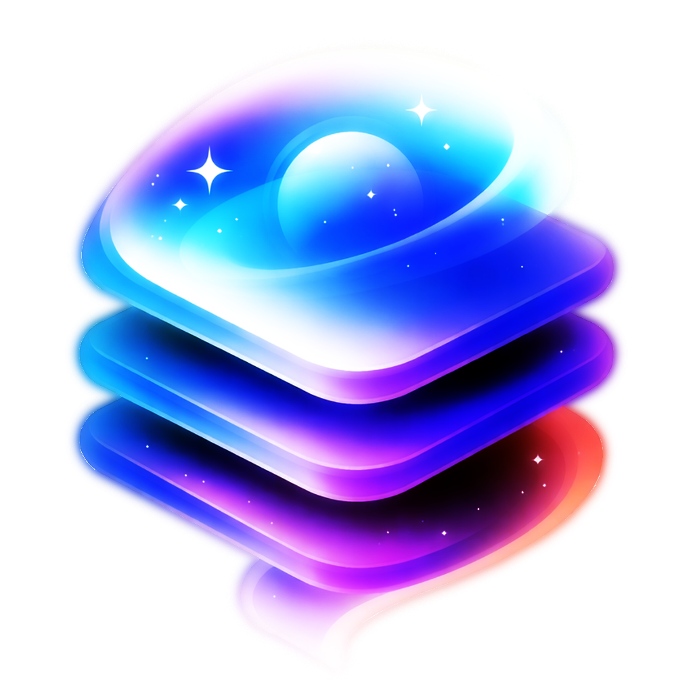

<header>

    

<h1 align='center' style='border-bottom: none;'>Dreamstack Raster</h1>
<h3 align='center'>Scape Agency</h3>
</header>

 

---

...

---

    <b>Made with 🖤 by <a href="https://www.scape.agency" target="_blank">Scape Agency</a></b> 
    Copyright 2026 Scape Agency. All Rights Reserved

